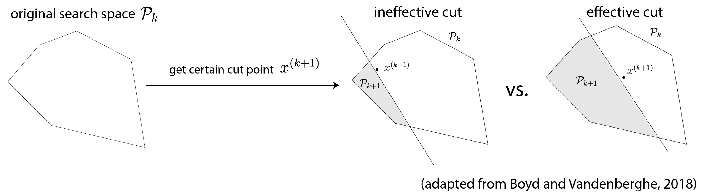

# Cutting-Plane Active Learning (CPAL)

Cutting-plane active learning is a novel active learning algorithm designed for supervised learning tasks using ReLU networks of arbitrary depths. This active learning scheme induces a gradient-free learning scheme and, to the best of our knowledge, is the first active learning algorithm as of date to have achieved theoretical convergence guarantees. 

🔗 Paper link: [Active Learning of Deep Neural Networks via Gradient-Free Cutting Planes](https://arxiv.org/pdf/2410.02145?)



🚨 ***Note:*** *This repository is under active development. This version is preliminary and subject to change.*

# Abstract
Active learning methods aim to improve sample complexity in machine learning. In this work, we investigate an active learning scheme via a novel gradient-free cutting-plane training method for ReLU networks of arbitrary depth and develop a convergence theory. 
We demonstrate, for the first time, that cutting-plane algorithms, traditionally used in linear models, can be extended to deep neural networks despite their nonconvexity and nonlinear decision boundaries. Moreover, this training method induces the first deep active learning scheme known to achieve convergence guarantees, revealing a geometric contraction rate of the feasible set. We exemplify the effectiveness of our proposed active learning method against popular deep active learning baselines via both synthetic data experiments and sentimental classification task on real datasets.

# Repo Structure

- `**scripts**`: `python` scripts for running various deep active learning methods for synthetic classification or regression tasks. 
    
    The primary scripts are as follows:
    - `**run_deepal_class.py**`: Run various deep active learning algorithms from [DeepAL](https://github.com/ej0cl6/deep-active-learning) on classification of a synthetic spiral. A sample code snipet to run the script is given as follows:
    <pre> ```bash python -m deepal_baseline.demo \ --n_round 3 \ --n_query 10 \ --n_init_labeled 10 \ --dataset_name Spiral \ --strategy_name EntropySampling \ --seed 1 ``` </pre>
    This runs the "Entropy Sampling" deep AL baseline on the synthetic Spiral dataset with 10 initial labels, a total of 3 rounds of querying with 10 queries in each round. 
    - **COMING UP**


# Citation

If you find our work useful, consider giving our repo a ⭐ and citing our paper as:

<pre>@inproceedings{
    zhang2025active,
    title={Active Learning of Deep Neural Networks via Gradient-Free Cutting Planes},
    author={Erica Zhang and Fangzhao Zhang and Mert Pilanci},
    booktitle={The Forty-Second International Conference on Machine Learning},
    year={2025},
    url={https://openreview.net/forum?id=SmYDdeLAR5}
}</pre>
